# 🚀 Clúster de Alta Disponibilidad — Laravel + MySQL sobre Máquinas Virtuales (Home Lab Cloud)

Este proyecto documenta cómo construí un entorno altamente disponible utilizando **Laravel**, **MySQL** y **Kubernetes** sobre máquinas virtuales propias, replicando conceptos y patrones habituales de infraestructuras cloud modernas.

El objetivo era entender qué ocurre detrás de las capas de abstracción que ofrecen proveedores como AWS o Google Cloud, construyendo un clúster Kubernetes "bare metal" donde pudiera gestionar directamente aspectos como la red, el almacenamiento, la persistencia y la recuperación ante fallos.

El laboratorio fue diseñado para tolerar fallos físicos reales y poner a prueba escenarios habituales de operación:

* Alta disponibilidad de aplicaciones.
* Almacenamiento distribuido.
* Failover automático y manual.
* Seguridad desacoplada del código fuente.
* Networking interno del clúster.
* Persistencia resiliente.
* Observabilidad y monitorización.

---

# 🏗️ Arquitectura General

## 📦 Stack Principal

* Kubernetes
* Laravel
* MySQL
* Nginx
* PHP-FPM (Patrón Sidecar)
* Longhorn
* Calico (Tigera Operator)
* Nginx Ingress Controller
* Kubernetes Dashboard
* Metrics Server

---

# 🔌 Infraestructura de Red, Seguridad y Almacenamiento

## 1️⃣ Red con Calico y DNS Local

### 📡 CNI: Calico mediante Tigera Operator

Instalé Calico utilizando los manifiestos oficiales:

```bash
kubectl apply -f tigera-operator.yaml
kubectl apply -f custom-resources.yaml
```

Posteriormente edité el recurso personalizado para definir manualmente el CIDR utilizado por el clúster:

```yaml
cidr: 192.168.0.0/16
```

Esto permitió:

* Gestionar de forma consistente las direcciones IP de Pods y nodos.
* Mantener una topología de red predecible.
* Garantizar la comunicación entre workloads distribuidos.

### 🌐 DNS Local mediante `/etc/hosts`

Para evitar depender de servicios DNS externos durante las pruebas, configuré resoluciones locales apuntando al Ingress Controller del clúster:

```txt
192.168.X.X laravel.app.com
192.168.X.X longhorn.local
```

---

## 2️⃣ Seguridad mediante ConfigMaps y Secrets

Para evitar almacenar información sensible en el repositorio, separé completamente la configuración pública de las credenciales privadas.

### 📦 ConfigMap de Aplicación

Variables compartidas entre los distintos Pods:

```yaml
DB_HOST=mysql
DB_PORT=3306
DB_DATABASE=laravel
APP_URL=http://laravel.app.com
```

### 🔑 Secret para la Base de Datos

Creado directamente desde línea de comandos:

```bash
kubectl create secret generic app-secrets \
  --from-literal=DB_PASSWORD='tu_password_secreto'
```

### 🐳 Secret para GitHub Container Registry (GHCR)

Las imágenes Docker de Laravel se almacenan en un registro privado:

```bash
kubectl create secret docker-registry github-registry-secret \
  --docker-server=ghcr.io \
  --docker-username='user' \
  --docker-password='PAT' \
  --docker-email='email'
```

Esto permite que Kubernetes descargue imágenes privadas sin exponer credenciales en Git.

### 🔒 Protección de Longhorn mediante Basic Auth

Para restringir el acceso a la interfaz web de Longhorn:

```bash
htpasswd -c auth admin
```

```bash
kubectl create secret generic longhorn-auth-secret \
  --from-file=auth \
  -n longhorn-system
```

---

## 3️⃣ Almacenamiento Distribuido con Longhorn

### 💾 Persistencia inspirada en entornos Cloud

Implementé Longhorn como solución de almacenamiento distribuido para Kubernetes.

Su función es similar al papel que desempeña AWS EBS en entornos cloud: proporcionar volúmenes persistentes desacoplados del ciclo de vida de los Pods.

Cuando MySQL solicita un PVC:

```yaml
storageClassName: longhorn
```

Longhorn:

* Aprovisiona automáticamente el volumen.
* Replica los datos entre múltiples nodos.
* Mantiene sincronización continua entre réplicas.
* Tolera fallos físicos de servidores.
* Reconstruye automáticamente las réplicas cuando un nodo vuelve a estar disponible.

---

# 📊 Observabilidad y Monitorización

## 4️⃣ Kubernetes Dashboard

Desplegué Kubernetes Dashboard para supervisar visualmente el estado del clúster.

Permite:

* Supervisar Pods y Deployments.
* Analizar consumo de CPU y memoria.
* Monitorizar el estado de los nodos.
* Verificar procesos de failover.
* Gestionar workloads desde una interfaz gráfica.

---

## 5️⃣ Metrics Server

Para obtener métricas en tiempo real instalé Metrics Server:

```bash
kubectl apply -f metrics-server.yaml
```

Una vez desplegado fue posible consultar el consumo real del clúster:

```bash
kubectl top nodes
```

```bash
kubectl top pods -A
```

Metrics Server resultó especialmente útil para:

* Analizar consumo real de CPU y memoria.
* Diagnosticar problemas de scheduling.
* Detectar configuraciones incorrectas de recursos.
* Validar el comportamiento de los Pods durante failovers.
* Correlacionar eventos del Scheduler con el uso efectivo del clúster.

---

# 🧠 Post-Mortem Técnico

## ⚠️ Problema #1 — `Insufficient CPU`

### 🐛 Síntoma

Tras apagar el nodo `slave1`, MySQL permanecía en estado:

```txt
Pending
```

Mostrando el mensaje:

```txt
Insufficient cpu
```

Aunque aparentemente seguían existiendo recursos disponibles en el clúster.

### 🔍 Investigación

Utilizando Metrics Server pude comprobar el uso real de recursos:

```bash
kubectl top nodes
```

```bash
kubectl top pods -A
```

Las métricas indicaban que el consumo efectivo de CPU era relativamente bajo, por lo que el problema no parecía estar relacionado con falta de capacidad física.

### 🔍 Causa

Tras revisar la configuración descubrí que existía un LimitRange aplicado por contenedor, heredado de pruebas anteriores. Además, uno de los nodos tenía un límite efectivo de 2000m de CPU disponible para scheduling. Esto me ayudó a entender que Kubernetes no “mata” los Pods por superar la CPU, sino que el problema ocurre a nivel de planificación, el scheduler no puede reubicar el Pod si los requests ya consumen la capacidad disponible del clúster.

Cada contenedor reservaba automáticamente:

```txt
500m CPU
```

Como Laravel utiliza el patrón Sidecar:

* PHP-FPM
* Nginx

La reserva efectiva por Pod era:

```txt
1000m CPU
```

A esto había que sumar las reservas realizadas por:

* Calico
* Longhorn
* Metrics Server
* Dashboard
* Pods del sistema

Aunque el consumo real era bajo, Kubernetes calculaba los recursos comprometidos a partir de los requests definidos, impidiendo que el Scheduler reubicara el Pod tras la caída de un nodo.

### ✅ Solución

Eliminé el `LimitRange` y ajusté los requests al consumo real observado en cada contenedor:

```yaml
          resources:
            requests:
              cpu: "100m"
              memory: "128Mi"
            limits:
              cpu: "400m"
              memory: "256Mi"
```

Resultado:

* MySQL volvió a desplegarse inmediatamente.
* Mejor aprovechamiento de recursos.
* Failover funcional.
* Requests alineados con el uso real.

---

## ⚠️ Problema #2 — Bloqueo del Volumen (Split-Brain)

### 🐛 Síntoma

Al apagar bruscamente la máquina virtual que alojaba una de las réplicas de almacenamiento:

* El PVC quedó bloqueado durante varios minutos.
* MySQL dejó de responder temporalmente.
* El volumen permanecía asociado al nodo caído.

### 🔍 Causa: Protección frente a Split-Brain

Longhorn incorpora mecanismos de protección para evitar escenarios de split-brain.

Cuando un nodo desaparece inesperadamente, Kubernetes no puede determinar inmediatamente si la caída es permanente o si el nodo volverá a estar disponible en unos minutos.

Por este motivo Longhorn bloquea temporalmente determinadas operaciones para evitar que varias réplicas potencialmente inconsistentes acepten escrituras simultáneamente, protegiendo así la integridad de los datos.

### ✅ Solución

Marqué el nodo como fuera de servicio utilizando:

```bash
kubectl taint nodes slave3-ubuntu-kubernetes node.kubernetes.io/out-of-service=nodeshutdown:NoExecute
```

Resultado:

* Failover inferior a 30 segundos.
* Sin pérdida de datos.
* Recuperación automática del servicio.
* Reconstrucción posterior de las réplicas al reincorporar el nodo.

---

# 📸 Evidencias del Clúster

## ✅ Infraestructura Estable

### Kubernetes Dashboard

Visualización del estado general del clúster y sus workloads.

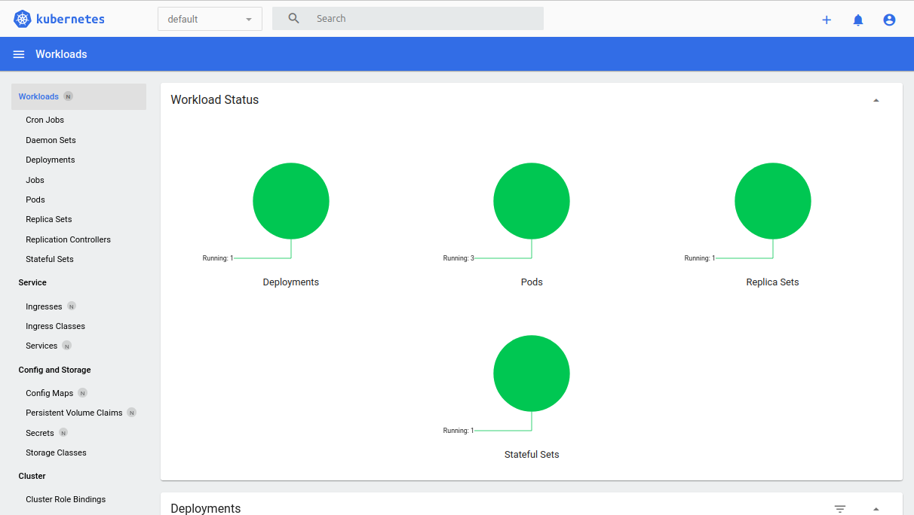

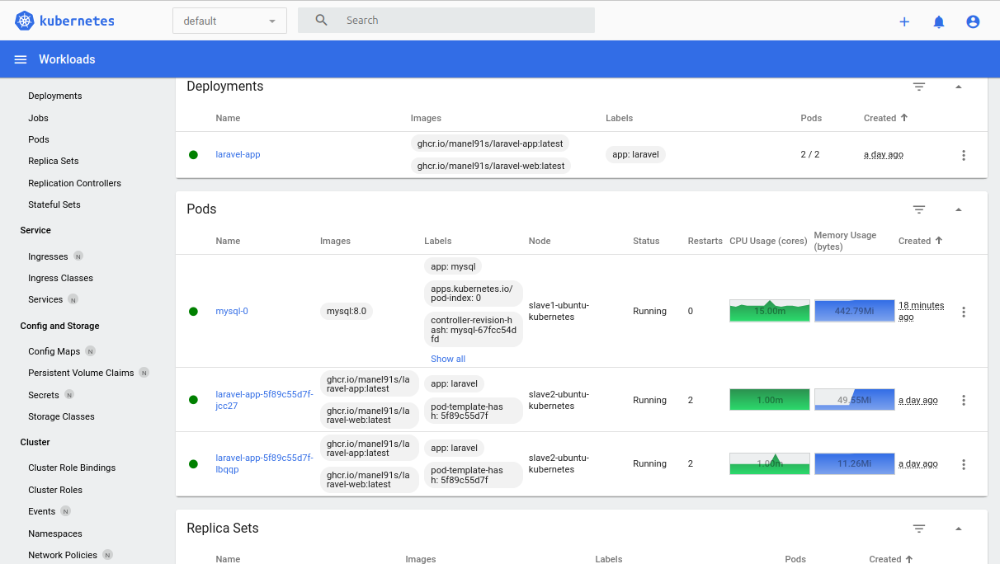

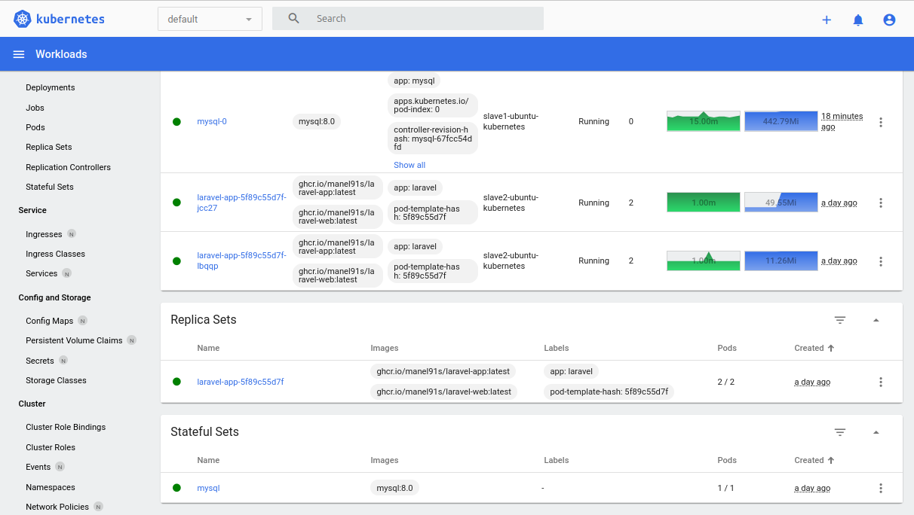

---

### Longhorn UI — Estado Healthy

Volumen de MySQL correctamente replicado entre nodos.

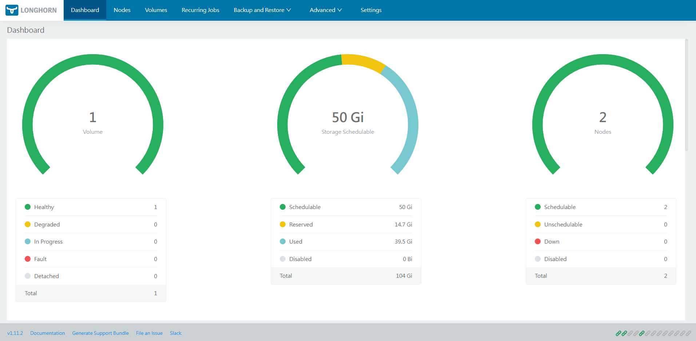

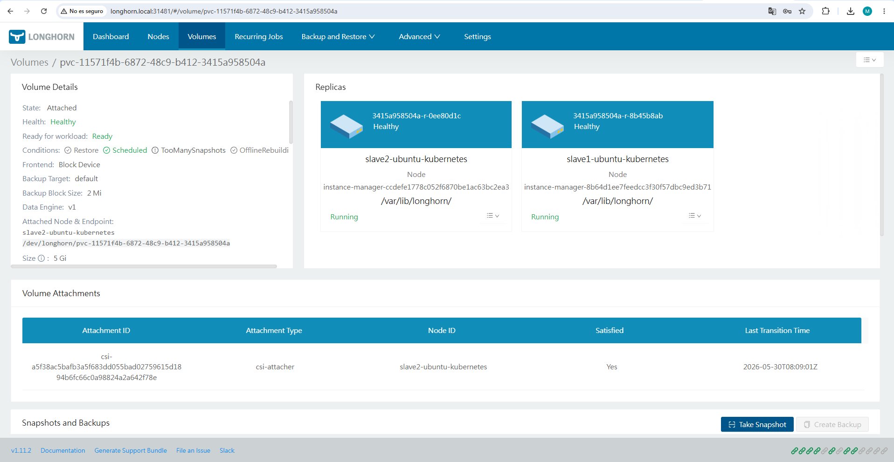

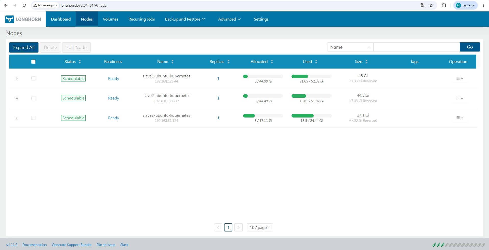

---

### Laravel funcionando

Aplicación desplegada mediante Ingress Controller.


---

## ⚠️ Comportamiento ante Fallos

### 🔄 Migración Automática del Pod MySQL

Failover del StatefulSet tras la caída de un nodo.

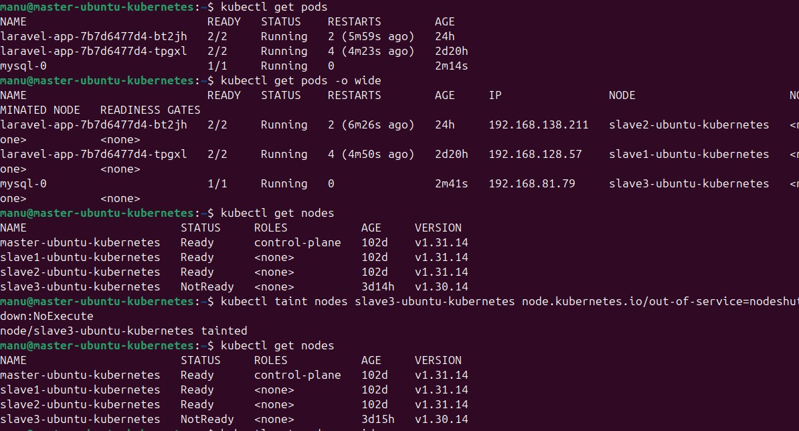

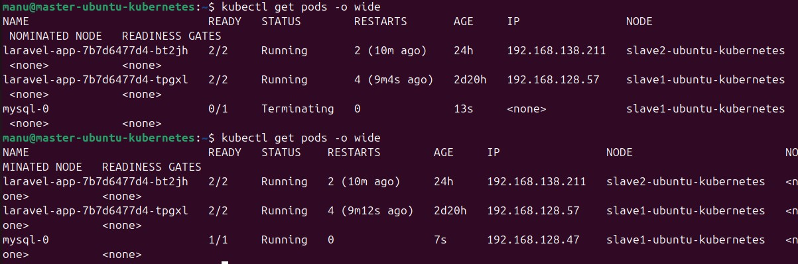

---

### 🟡 Longhorn en estado Degraded

El almacenamiento continúa disponible incluso durante la caída de una máquina virtual.

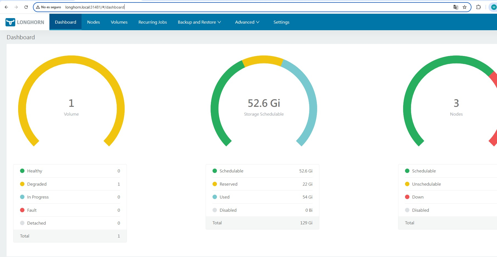

---

### ♻️ Recuperación Automática

Sincronización y recuperación de los Pods tras restaurar el nodo.

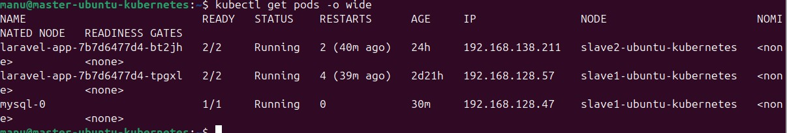

---

### ♻️ Reconstrucción de Réplicas tras Retirar el Taint

Proceso de reconstrucción automática del volumen una vez que el nodo vuelve a estar disponible.

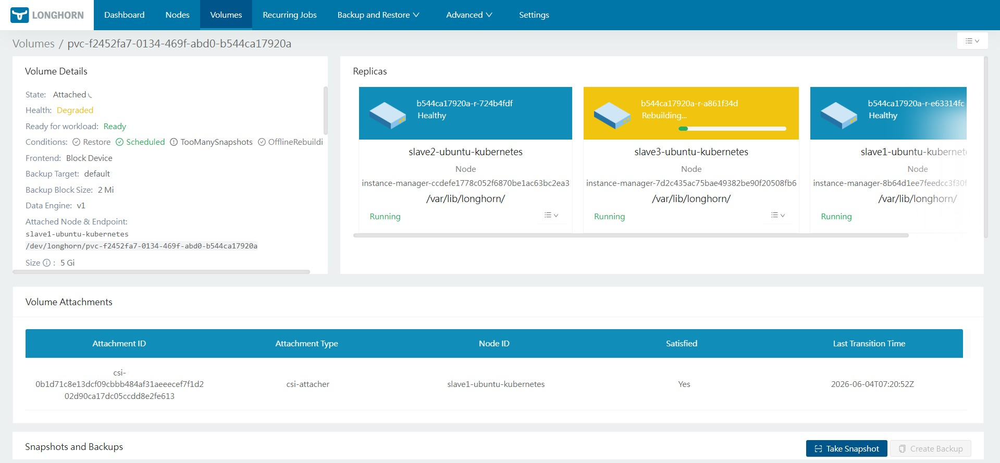

---

# 🚀 Roadmap

## 🔄 Automatización CI/CD

Implementar:

* GitHub Actions
* GitLab CI

Objetivos:

* Build automático.
* Push a registro privado.
* Despliegue automático en Kubernetes.

---

## 🧪 Estrategia Multi-Entorno

Separar:

* `staging`
* `production`

Mediante Namespaces independientes.

---

## ⚙️ GitOps

Integrar:

* ArgoCD

Para gestionar infraestructura y aplicaciones mediante un enfoque declarativo.

---

# 🏁 Conclusión

El objetivo principal de este laboratorio era comprender mejor los componentes internos de Kubernetes que normalmente quedan ocultos tras los servicios gestionados de los proveedores cloud.

Por ese motivo decidí construir el entorno sobre Kubernetes Bare-Metal, gestionando directamente aspectos como el networking entre Pods mediante Calico, el almacenamiento distribuido con Longhorn, la gestión de recursos del Scheduler y los mecanismos de recuperación ante fallos.

Más allá del despliegue de la aplicación, el proyecto permitió analizar situaciones reales de operación, diagnosticar problemas de scheduling, comprender el comportamiento de los volúmenes distribuidos y experimentar procesos de failover similares a los que pueden encontrarse en entornos productivos.

Todo ello ejecutándose sobre hardware local y máquinas virtuales propias, reproduciendo muchos de los retos habituales de una plataforma Kubernetes moderna.
